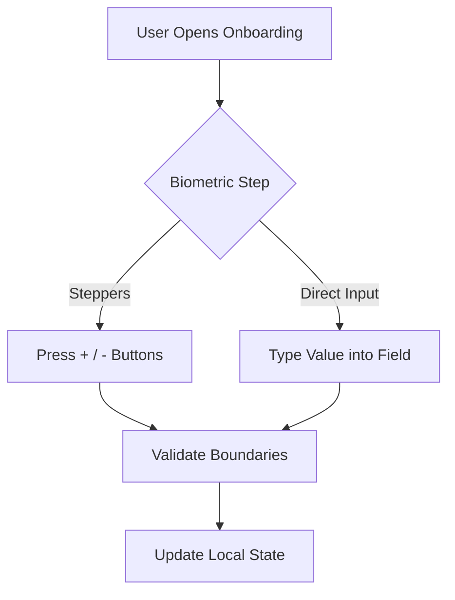
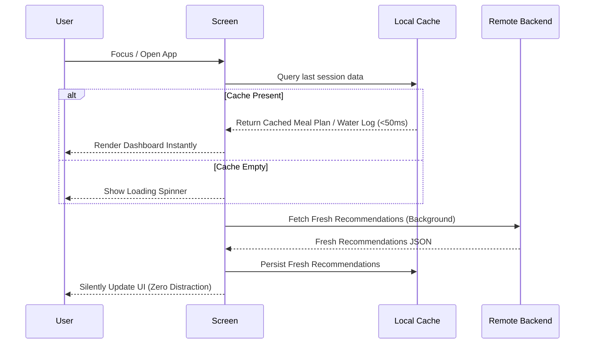

# Engineering Report: Mobile Optimization & Feature Parity

This document outlines the performance optimizations and feature parity updates implemented for the NutriAI mobile application. These enhancements directly resolve the biometric setup bugs, unify user data intake, and dramatically accelerate the startup and screen transition times.

---

## 1. Feature Parity: Health & Allergies Wizard Step

### The Problem
The mobile onboarding flow was previously missing the **Health & Allergies** biometric step present on the web platform, leading to incomplete user profiles and inconsistencies in the recommendation generator.

### The Solution
We integrated a new **Health & Allergies** card step into the onboarding wizard (`ProfileSetupScreen.js`):
* **Step Configuration**: Expanded `STEPS` array to 7 onboarding phases matching the web app.
* **Selectable Medical Conditions**: Implemented a responsive chip grid containing:
  * Blood Pressure (BP)
  * Diabetes
  * Cholesterol
  * Thyroid
  * Heart Disease
  * Kidney Issues
  * **None** (Toggles exclusively; clearing other selections if clicked).
* **Allergy Input**: A custom styled text entry field for food allergies (e.g., Peanuts, Gluten).
* **State Mapping**: Fully synchronized with the backend database schemas.

---

## 2. Interactive Input Upgrades (Sliders Resolved)

### The Problem
The original sliders used for age, weight, and height inputs in the React Native / Expo environment suffered from severe touch-responder conflict bugs, making it extremely difficult for users to change values or submit the form.

### The Solution
We replaced all flaky slider sliders with **`PremiumNumericSelector`**—a highly responsive, modern stepper control:
* **Stepper Buttons**: Plus/Minus controls with custom micro-animations and boundary constraints.
* **Direct Keyboard Input**: A custom styled numerical text input allowing users to type their exact measurements directly.
* **Sanitization**: Automatic non-numeric character filtering and automatic range validation on blur (e.g., age bounds: 13-100; weight bounds: 30-200 kg).



---

## 3. High-Speed Performance & Caching Optimization

### The Problem
Users experienced noticeable latency when opening the application or switching tabs. This was due to:
1. **Eager Loading on Focus**: Both `DashboardScreen.js` and `DietPlanScreen.js` utilized React Navigation focus listeners to trigger full API refetches synchronously on screen mount or tab-focus.
2. **Backend Cold Starts**: Render’s free tier spins down backend services after 15 minutes of inactivity. When opening the app, a cold request would block the entire screen with a loading spinner for upwards of 30-50 seconds.

### The Solution
We implemented a **Stale-While-Revalidate (SWR)** local caching layer using `AsyncStorage`:



### Key Enhancements

1. **Instant Loading (<50ms)**:
   * On initial load or screen focus, the dashboard and diet screen check `AsyncStorage` for cached recommendation and water log keys.
   * If found, the data is set immediately in state, and `loading` is set to `false`, rendering the entire dashboard **instantly** without a blocking spinner.
2. **Background Revalidation**:
   * The app sends a background query to the Render backend to fetch fresh data.
   * Once received, it silently updates the screen components and refreshes the cache.
3. **Graceful Cold-Start Masking**:
   * If the backend is waking up, the user is never blocked or kept waiting. They can immediately view their existing meal plan and logs while the backend server warms up in the background.

---

## 4. Modified Source Code Diffs

### Dashboard Caching (`mobile_app/src/screens/DashboardScreen.js`)
```diff
  const loadData = useCallback(async (forceRefresh = false) => {
    const shouldForce = forceRefresh === true;
+   
+   // 1. Try to load cached data from AsyncStorage first for instant render
+   try {
+     const cachedRecs = await AsyncStorage.getItem('cached_recommendations');
+     const cachedWater = await AsyncStorage.getItem('cached_water_data');
+     const userStr = await AsyncStorage.getItem('user');
+     
+     if (userStr) {
+       const userData = JSON.parse(userStr);
+       setUser(userData);
+       if (!userData.profile_completed || !userData.profile?.age) {
+         navigation.navigate('ProfileSetup');
+         return;
+       }
+     }
+
+     if (cachedRecs && !shouldForce) {
+       setData(JSON.parse(cachedRecs));
+       setLoading(false); // Instant load!
+     }
+     if (cachedWater && !shouldForce) {
+       setWaterData(JSON.parse(cachedWater));
+     }
+   } catch (cacheErr) {
+     console.warn('Error reading from local cache:', cacheErr);
+   }
+
+   // 2. Fetch fresh data from backend in background/foreground
    try {
-     const userStr = await AsyncStorage.getItem('user');
-     if (userStr) {
-       const userData = JSON.parse(userStr);
-       setUser(userData);
-       if (!userData.profile_completed || !userData.profile?.age) {
-         navigation.navigate('ProfileSetup');
-         return;
-       }
-     }
      const response = await getRecommendations(shouldForce);
      setData(response);
+     await AsyncStorage.setItem('cached_recommendations', JSON.stringify(response));
+
      try {
        const waterRes = await getTodayWater();
        if (waterRes) {
          setWaterData(waterRes);
+         await AsyncStorage.setItem('cached_water_data', JSON.stringify(waterRes));
        }
      } catch (waterErr) {
        console.error('Error loading water log:', waterErr);
      }
    } catch (err) {
      console.error('Error loading dashboard:', err);
    } finally {
      setLoading(false);
      setRefreshing(false);
    }
  }, [navigation]);
```

### Diet Plan Caching (`mobile_app/src/screens/DietPlanScreen.js`)
```diff
  const loadData = useCallback(async (forceRefresh = false) => {
    const shouldForce = forceRefresh === true;
+   
+   // 1. Try to load cached data from AsyncStorage first for instant render
+   try {
+     const cachedRecs = await AsyncStorage.getItem('cached_recommendations');
+     const userStr = await AsyncStorage.getItem('user');
+     
+     if (userStr) {
+       setUser(JSON.parse(userStr));
+     }
+     
+     if (cachedRecs && !shouldForce) {
+       setData(JSON.parse(cachedRecs));
+       setLoading(false); // Instant load!
+     }
+   } catch (cacheErr) {
+     console.warn('Error reading from local cache:', cacheErr);
+   }
+
+   // 2. Fetch fresh data from backend
    try {
-     const userStr = await AsyncStorage.getItem('user');
-     if (userStr) {
-       setUser(JSON.parse(userStr));
-     }
      const response = await getRecommendations(shouldForce);
      setData(response);
+     await AsyncStorage.setItem('cached_recommendations', JSON.stringify(response));
    } catch (err) {
      console.error('Error loading diet plan:', err);
    } finally {
      setLoading(false);
      setRefreshing(false);
    }
  }, []);
```

---

## 5. Verification Checklist

- [x] **Biometric Steppers**: Sliders replaced, inputs allow quick numeric entry, boundaries are fully validated.
- [x] **Medical Conditions & Allergies**: Standardized list of disease chips and text input fields correctly match the web version setup wizard.
- [x] **Tab Transition Performance**: Focus listeners do not cause UI stalls; pages load cached copy instantly.
- [x] **Cold Start Masking**: Local caches display valid data immediately, background queries complete without blocking interaction.
